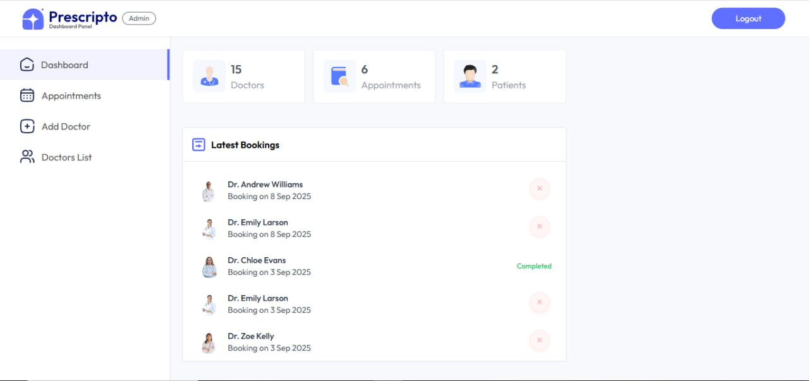

# 🩺 Prescripto – Doctor Appointment App


Prescripto is a full-stack Doctor Appointment Booking Web Application that allows users to book appointments with doctors, manage their health records, and provides an admin panel for streamlined control. Built using the **MERN stack**, it is designed for speed, security, and scalability.

## 🚀 Live Demo

🌐 Frontend: [https://prescripto-frontend-roan.vercel.app/](https://prescripto-frontend-roan.vercel.app/)

## 🛠️ Tech Stack

- **Frontend:** React.js, Tailwind CSS, React Router, Axios
- **Backend:** Node.js, Express.js
- **Database:** MongoDB (Mongoose)
- **Authentication:** JWT (JSON Web Token)
- **Cloud:** Cloudinary (for image upload)
- **Payments (Optional):** Razorpay

---

## 📸 Screenshots

| User Dashboard | Admin Panel |
|----------------|-------------|
|  |  |


---

## 🔐 Features

### 👨‍⚕️ User Side
- Signup/Login with JWT Auth
- View available doctors
- Book appointment with time slot
- View upcoming & past bookings

### 🧑‍⚕️ Doctor/Admin Side
- Admin login
- Add or remove doctor profiles
- Manage all appointments
- View user activity

### 📂 Others
- Dynamic Routing
- Cloud image upload using Cloudinary
- Responsive UI (Mobile Friendly)
- Error handling and toast notifications

---

## 📁 Folder Structure

```
prescripto_full-stack_doctor_appointment_app/
├── backend/
│   ├── config/
│   ├── controllers/
│   ├── models/
│   ├── routes/
│   ├── utils/
│   └── index.js
├── frontend/
│   ├── public/
│   └── src/
│       ├── components/
│       ├── pages/
│       ├── context/
│       └── App.js
```

---

## 🔧 Installation

### 1. Clone the repository

```bash
git clone https://github.com/kamleshgupta905/Prescripto-project.git
cd Prescripto-project
```

### 2. Setup Backend

```bash
cd backend
npm install
# Create a .env file and add the following:
# MONGODB_URI=your_mongodb_uri
# JWT_SECRET=your_jwt_secret
# CLOUDINARY_NAME=your_cloudinary_name
# CLOUDINARY_API_KEY=your_api_key
# CLOUDINARY_SECRET_KEY=your_secret_key
npm run server
```

### 3. Setup Frontend

```bash
cd ../frontend
npm install
npm run dev
```

---

## 🌐 Environment Variables

**Backend `.env`**
```env
PORT=5000
MONGODB_URI=your_mongo_uri
JWT_SECRET=your_jwt_secret
CLOUDINARY_NAME=your_cloudinary_name
CLOUDINARY_API_KEY=your_cloudinary_api_key
CLOUDINARY_SECRET_KEY=your_cloudinary_secret
```

---

## 🤝 Contributing

Contributions, issues and feature requests are welcome!<br>
Feel free to check the [issues page](https://github.com/kamleshgupta905/Prescripto-project/issues).

---

## 📜 License

This project is licensed under the MIT License - see the [LICENSE](LICENSE) file for details.

---

## 🙋‍♂️ Author

**Kamlesh Gupta**  
📧 kamleshg9569@gmail.com  
🌐 [Portfolio](https://kamleshgupta.vercel.app)
